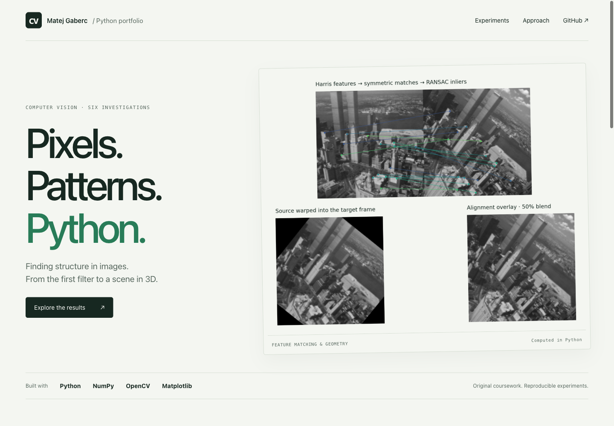
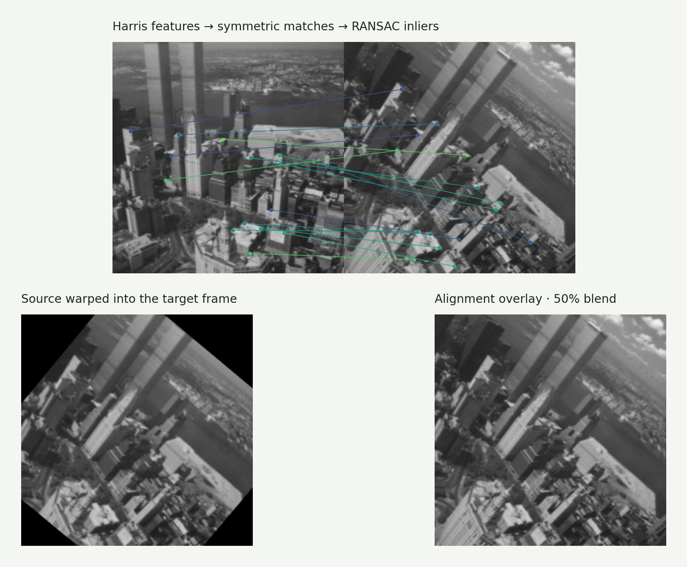
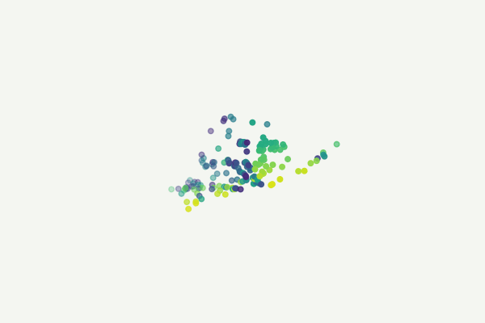
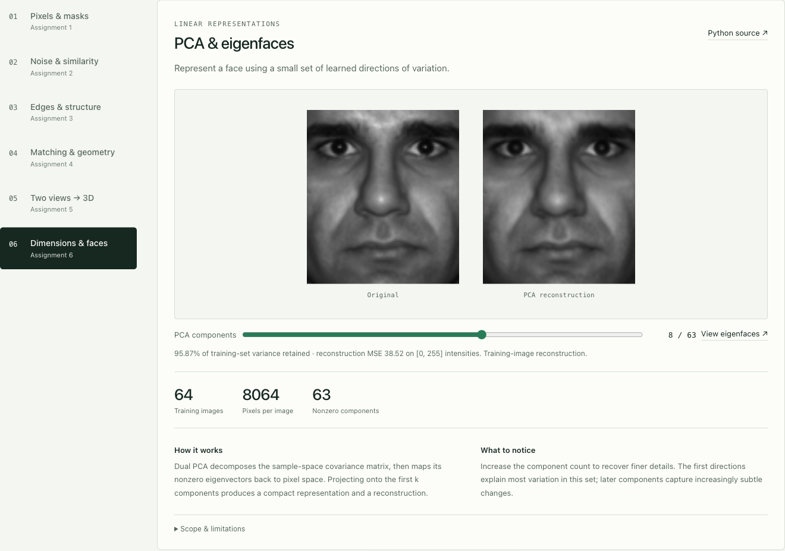

# Computer Vision in Python

### Pixels. Patterns. Python.

**Six investigations into how images become structure.** Image processing, retrieval, edge detection, geometric alignment, 3D reconstruction and PCA, implemented with Python, NumPy and OpenCV.

**[Explore the source](cvportfolio/) · [Original coursework](coursework/) · [Run the experiments](#run-it-yourself) · [Implementation notes](PROVENANCE.md)**



I'm **Matej Gaberc**, a multimedia student building software, AI integrations and business automations. This repository presents my work from **Umetno zaznavanje (Machine Perception)**: implementing algorithms, working with numerical data and making the output understandable.

The original assignments are preserved alongside a reproducible experiment runner and an interactive results viewer. Every figure below is generated from Python calculations on the supplied course data.

## Start with these three

### Align two views of the same scene

Harris feature points, symmetric descriptor matching and a custom RANSAC loop feed a normalized DLT homography estimator. The result is checked by projecting matched points into the second image.



**15 of 16 candidate matches retained · 0.52 px median inlier error · 1,000 RANSAC iterations**

These are measurements for the included New York pair, not a general accuracy benchmark. [Python implementation →](cvportfolio/features.py)

### Recover 3D structure from two images

A normalized eight-point algorithm estimates epipolar geometry. Linear triangulation uses the supplied camera matrices and corresponding points to recover a sparse model of a house.



**168 reconstructed points · 0.207 px mean camera reprojection error**

The input correspondences and camera calibration are supplied by the course dataset. [Python implementation →](cvportfolio/geometry.py)

### Reconstruct a face with fewer dimensions

Dual PCA learns directions of variation from 64 images. The viewer lets you compare reconstructions with 1, 2, 4, 8, 16 or 32 components.



**8,064 pixels per image · 63 nonzero components · 95.87% training-set variance retained with 8 components**

This is training-image reconstruction, not a held-out face recognition score. [Python implementation →](cvportfolio/pca.py)

## All six studies

| Study | Concepts implemented in the coursework | Curated result |
|---|---|---|
| **01 · Image processing** | Array manipulation, normalized histograms, thresholding, masks, morphology and connected regions | [Foreground extraction & histogram](docs/assets/01-processing.png) |
| **02 · Filtering & retrieval** | Convolution, Gaussian and median filters, RGB histograms, L2 / χ² / intersection / Hellinger distances | [Noise removal](docs/assets/02-filtering.png) · [120-image retrieval](docs/assets/02-retrieval.png) |
| **03 · Edges & Hough** | Gaussian derivatives, gradients, non-maximum suppression, hysteresis, line and circle voting | [Edges & line hypotheses](docs/assets/03-edges.png) |
| **04 · Matching & alignment** | Harris/Hessian features, symmetric matching, RANSAC, homography, image warping; optional stabilization code | [Correspondences & alignment](docs/assets/04-homography.png) |
| **05 · Stereo & 3D** | NCC disparity, fundamental matrix, epipolar distances, rank constraint, triangulation | [Sparse 3D reconstruction](docs/assets/05-stereo.png) |
| **06 · PCA & eigenfaces** | Direct/dual PCA, projection, reconstruction, explained variance; optional webcam example | [Reconstruction](docs/assets/06-pca.png) · [Eigenfaces](docs/assets/06-eigenfaces.png) |

The curated runner demonstrates selected exercises from every assignment. Original optional experiments are retained for inspection and are not all part of the verified showcase.

## What this demonstrates

- **Numerical Python:** shapes, dtypes, vectorization, matrix operations, eigendecomposition and SVD.
- **Algorithm implementation:** turning mathematical definitions into inspectable functions instead of hiding every step behind a high-level estimator.
- **Practical computer vision:** working with noisy images, ambiguous matches, outliers and coordinate systems.
- **Verification:** analytical examples with known answers, regression checks and explicit limits on what each result establishes.
- **Communication:** visual results, source links, measured outputs and reproducible instructions.

OpenCV handles image I/O, primitive filtering, morphology and warping; supplied course helpers provide descriptors and point normalization. The detailed division is documented in [PROVENANCE.md](PROVENANCE.md).

## Run it yourself

Use Python **3.12 or newer**. From the repository root:

```bash
git clone https://github.com/gabercmatej/computer-vision-python.git
cd computer-vision-python
python -m venv .venv
source .venv/bin/activate
python -m pip install -r requirements.txt
python -m cvportfolio.generate
```

On Windows, activate with `.venv\Scripts\activate` instead. The headless OpenCV dependency supports the curated generator; optional original webcam/video windows require a GUI-enabled OpenCV environment.

Generate only one study:

```bash
python -m cvportfolio.generate --only 4
```

A complete run writes the shared metrics manifest; use a complete run after algorithm changes to keep the viewer's figures and measurements synchronized.

Open the viewer:

```bash
python -m http.server 8000 --directory docs
```

Then open **http://localhost:8000**. The static viewer explores precomputed results; it does not run Python in the browser. It also works by opening `docs/index.html` directly, though browser clipboard access may be restricted.

## Verify the work

```bash
python -m unittest discover -s tests -v
python -m cvportfolio.generate
python scripts/check_assets.py
```

The **16 numerical tests** cover convolution, histogram normalization/distances, deterministic thresholding, edge connectivity and directions, spatial feature suppression, empty matches, homography recovery and degeneracy, seeded RANSAC outlier rejection, epipolar geometry, triangulation, and PCA orthonormality/reconstruction.

GitHub Actions runs the tests and regenerates all six studies on Python 3.12. The checked-in outputs were generated on Python 3.14; exact library versions and all metrics are recorded in [metrics.json](docs/assets/metrics.json). Small floating-point or rendering differences across environments are expected.

## Repository map

```text
coursework/           Original submissions, assignment PDFs, helpers and datasets
cvportfolio/          Importable algorithms adapted from the submissions
  course_utils/       Attributed course-provided helpers
  generate.py         Six result-generation routines
  processing.py       Histograms, Otsu threshold and masking
  filters.py          Convolution, filtering and histogram comparison
  edges.py            Derivatives, edge extraction and Hough voting
  features.py         Feature matching, normalized DLT and RANSAC
  geometry.py         Epipolar geometry and triangulation
  pca.py              Dual PCA
tests/               Numerical checks with known expected results
docs/                Static interactive showcase
  assets/             Python-generated figures, animation and numeric metrics
  screenshots/        Actual desktop/mobile screenshots of the viewer
scripts/             Asset and manifest validation
```

## Notes & credits

The reusable modules, correctness fixes, tests and portfolio interface were prepared with Codex assistance. The original student scripts remain separately available so the coursework and later presentation work can be inspected independently. See [changes](CHANGELOG.md), [provenance](PROVENANCE.md) and [course material credits](ATTRIBUTION.md).

Course PDFs, helpers and datasets retain their original authorship; no blanket license is applied to third-party materials.

**[More projects by Matej Gaberc →](https://github.com/gabercmatej)**
