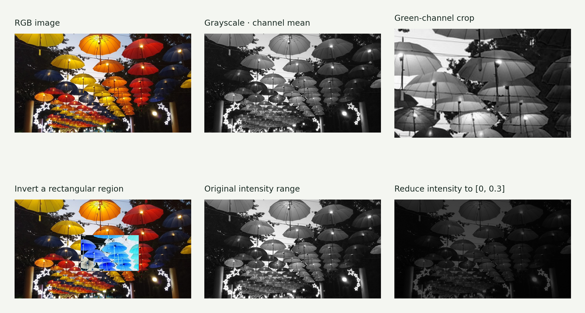
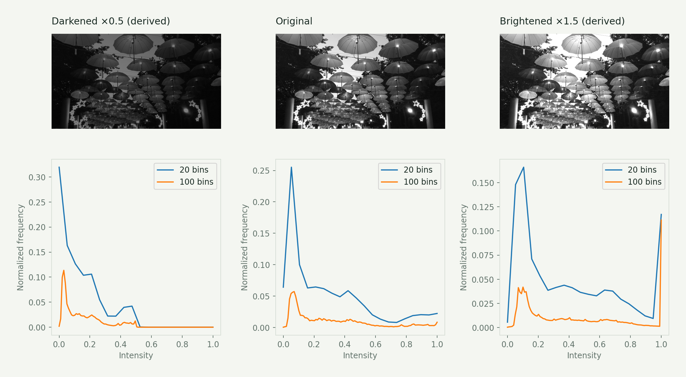
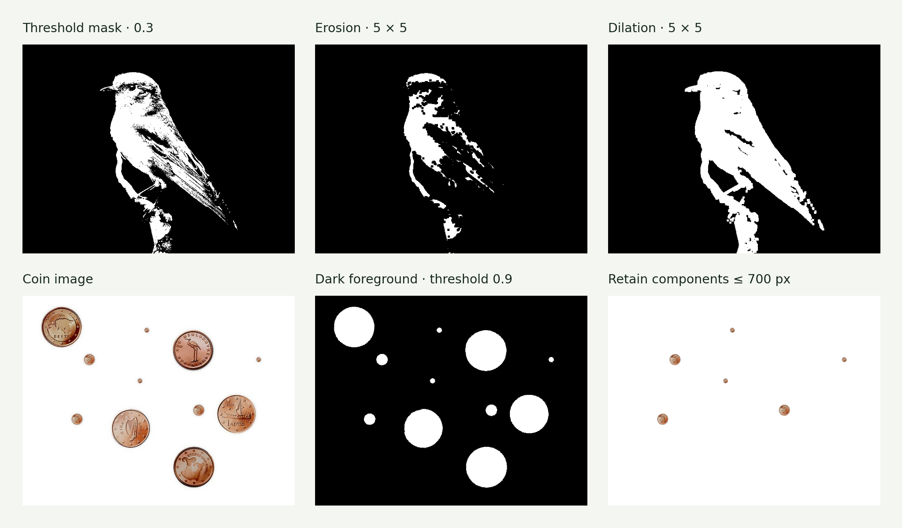
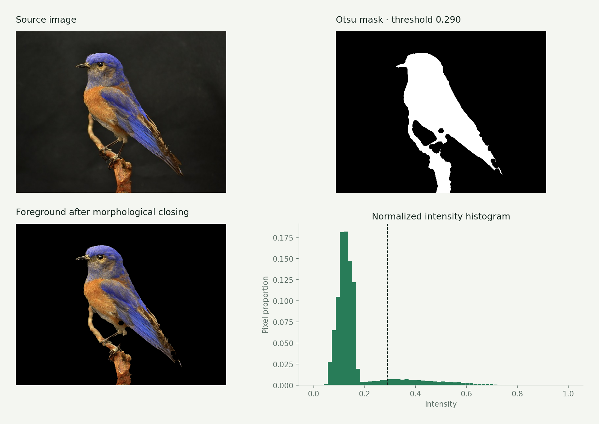

# Assignment 1 · Image processing, histograms & morphology

Images become arrays: manipulate pixels, measure intensity distributions, and separate foreground regions.

[Original Python submission](assigment1.py) · [Assignment PDF](instructions.pdf) · [Interactive companion](https://gabercmatej.github.io/computer-vision-python/#study-1)

### 1.1 Basic image processing

Load RGB images, compute grayscale from channel means, inspect a green-channel crop, invert a rectangular patch and reduce the intensity range. Array slicing and broadcasting let the same operation act on thousands of pixels.

**Source sections:** 1a–1e.

The plate uses a fixed [0, 1] display range so the reduced-intensity image actually appears darker.

### 1.2 Thresholding & histograms

Implement threshold masks in two ways and build a normalized histogram with configurable bins. Compare exposure distributions, then select a foreground threshold with Otsu’s between-class criterion.

**Source sections:** 2a–2d.

The original bright/dark files were not supplied; these explicitly labeled variants are derived from the available image. The runnable Otsu version is deterministic; the original submission uses sampling.

### 1.3 Morphology & connected components

Implement erosion and dilation experiments, clean a bird mask, apply it to RGB channels, invert an eagle mask and filter coin-image connected components by area. Morphology changes local shape; component analysis selects whole regions.

**Source sections:** 3a–3e.

This plate compares bird erosion/dilation and coin components. The coin visualization explicitly uses 0.9, correcting the original threshold-variable typo; it omits the exploratory large-kernel cleanup to make the area selection visible.

### Additional result · Bird segmentation & foreground masking

## Source coverage & reproduction

All three main exercises are represented. Original plots are mostly disabled; the crop expression is commented in the submission.

The source contains exploratory alternatives and disabled plotting blocks. For a supported reproduction, use the [showcase generator](../showcase/README.md). Course utilities and datasets retain their original authorship; see [credits](../ATTRIBUTION.md).

[← All six assignments](../README.md)
