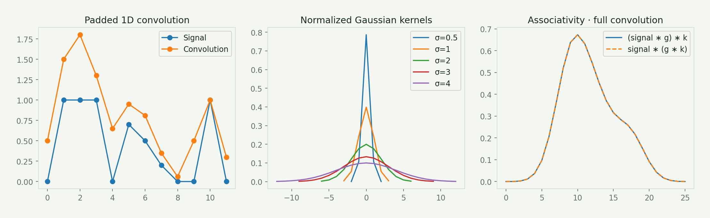
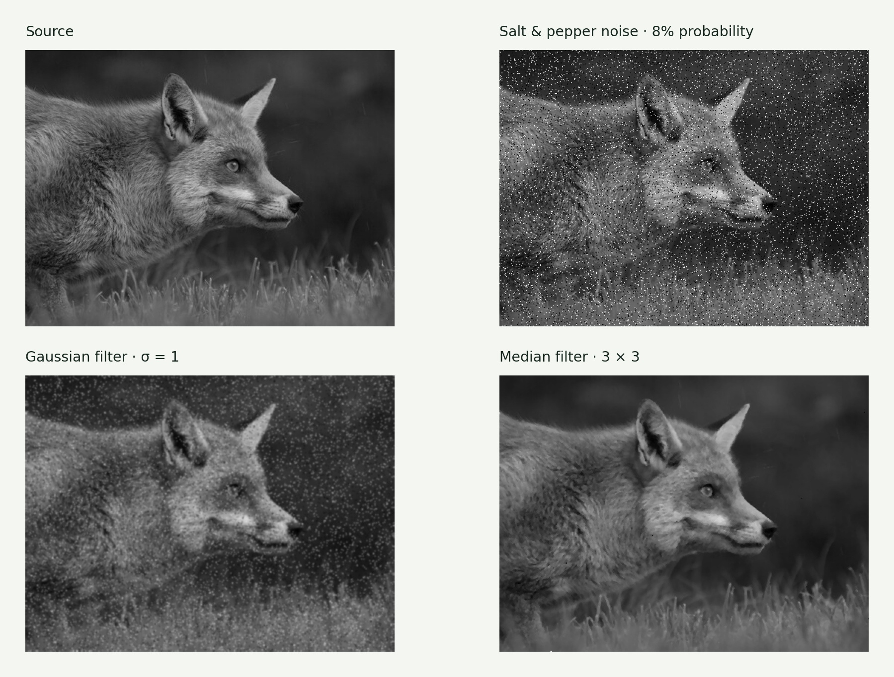
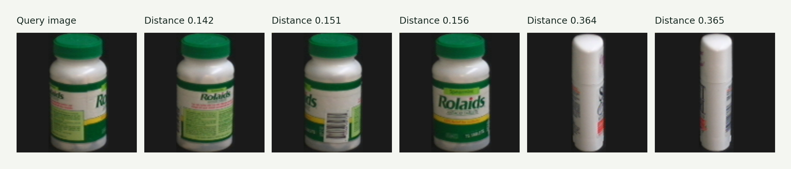
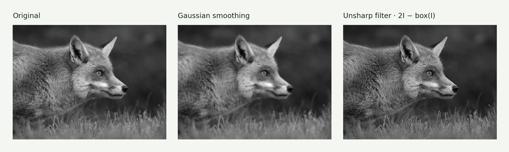
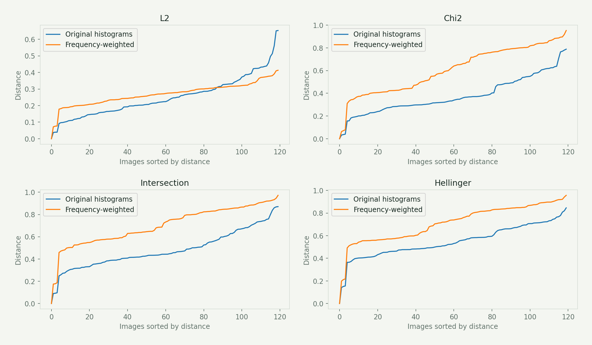

# Assignment 2 · Convolution, filtering & image retrieval

Build local signal operators, compare noise-removal filters, and search an image collection with compact color descriptions.

[Original Python submission](assigment2.py) · [Assignment PDF](assignment2_instructions.pdf) · [Interactive companion](https://gabercmatej.github.io/computer-vision-python/#study-2)

### 2.1 1D convolution

Write convolution and boundary handling, generate normalized Gaussian kernels for several scales, and explore how composing kernels changes a signal. A kernel slides over neighboring samples and forms a weighted sum.

**Source sections:** 1a–1e.

The associativity illustration uses full convolution to avoid truncation at intermediate boundaries; the submission also explores padded filtering.

### 2.2 Image filtering

Apply separable Gaussian filtering to noisy images, sharpen with a custom kernel, compare 1D median windows and implement a 2D median filter. Median filtering rejects isolated impulses while Gaussian averaging smooths both noise and detail.

**Source sections:** 2a–2d.

A fixed synthetic salt-and-pepper sample makes this comparison reproducible. The source also contains Gaussian-noise and Lena experiments.

### 2.3 Global descriptors & retrieval

Build an 8 × 8 × 8 RGB histogram, implement L2, chi-square, intersection and Hellinger distances, rank a 120-image collection, inspect sorted distances and weight frequent colors less strongly.

**Source sections:** 3a–3f.

The query is excluded from its own nearest-neighbor results. Histogram similarity describes color, not object identity; no dataset-wide accuracy is claimed.

### Additional result · Sharpening comparison

### Additional result · Four distance functions & frequency weighting

## Source coverage & reproduction

The submission includes the weighting implementation; its plotting block was disabled. The regenerated comparison does not claim weighting improves retrieval accuracy.

The source contains exploratory alternatives and disabled plotting blocks. For a supported reproduction, use the [showcase generator](../showcase/README.md). Course utilities and datasets retain their original authorship; see [credits](../ATTRIBUTION.md).

[← All six assignments](../README.md)
