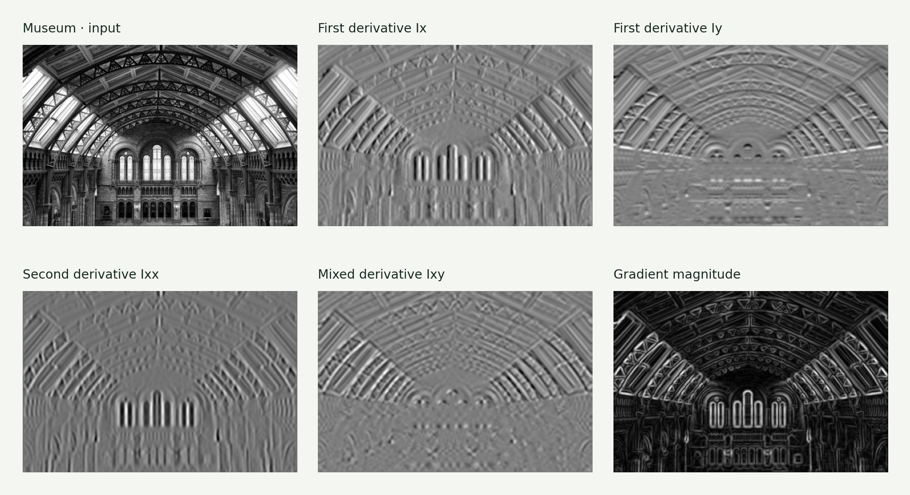
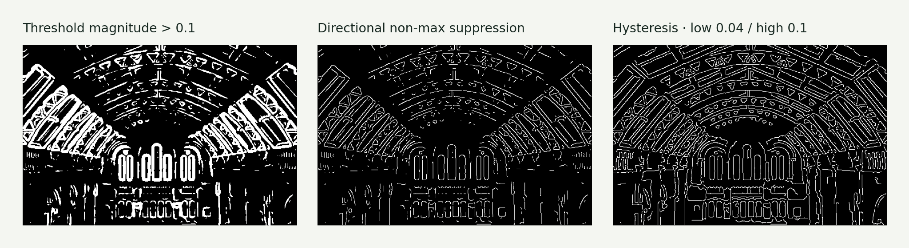
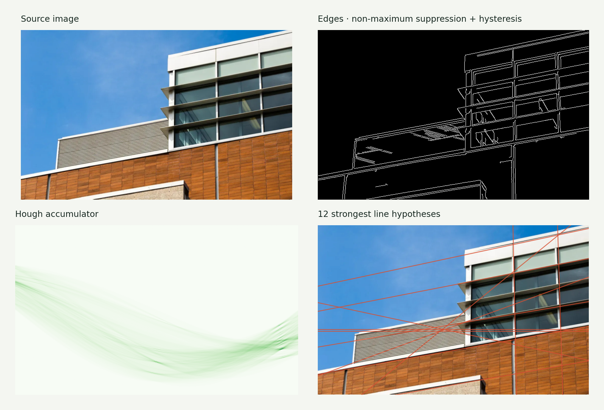
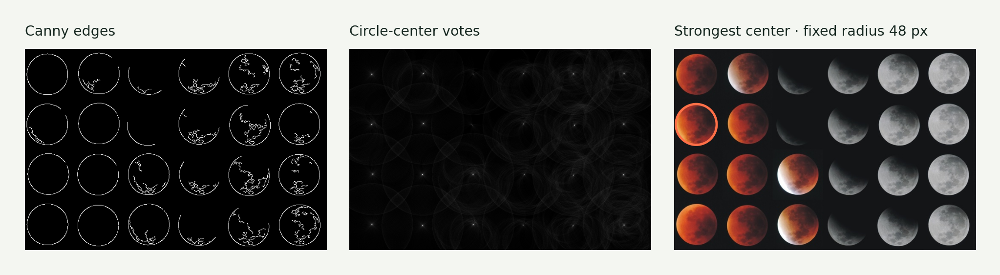

# Assignment 3 · Derivatives, edges & the Hough transform

Progress from local intensity changes to thin edges and geometric line or circle hypotheses.

[Original Python submission](assigment3.py) · [Assignment PDF](assignment3_instructions.pdf) · [Interactive companion](https://gabercmatej.github.io/computer-vision-python/#study-3)

### 3.1 Image derivatives

Construct Gaussian derivative filters, inspect impulse responses, calculate first and second image derivatives, and derive gradient magnitude and orientation. Also implement an 8 × 8 spatial grid with 8 orientation bins: a 512-dimensional gradient descriptor.

**Source sections:** 1a–1e.

The descriptor is implemented, but its requested integration into the retrieval system is not present.

### 3.2 Edge detection

Threshold gradient magnitude, suppress responses across the gradient direction, then use connected-component hysteresis to retain weak edges linked to strong ones. Each step removes a different kind of ambiguity.

**Source sections:** 2a–2c.

The reusable implementation includes corrected suppression and hysteresis. Four threshold settings remain available in the interactive demo.

### 3.3 Hough voting

Implement line-parameter accumulators, threshold peaks, suppress neighboring maxima and draw strong line hypotheses on images. Extend voting to circle centers when the radius is known.

**Source sections:** 3a–3e, 3g.

The building example displays 12 line hypotheses. Optional gradient-directed voting (3f) and line-length normalization (3h) are blank in the original.

### Additional result · Known-radius circle detection

## Source coverage & reproduction

Circle output shows the strongest voted center at radius 48 px. The original exploratory plot displayed every center above a threshold; this presentation also uses repeated-index-safe vote accumulation.

The source contains exploratory alternatives and disabled plotting blocks. For a supported reproduction, use the [showcase generator](../showcase/README.md). Course utilities and datasets retain their original authorship; see [credits](../ATTRIBUTION.md).

[← All six assignments](../README.md)
