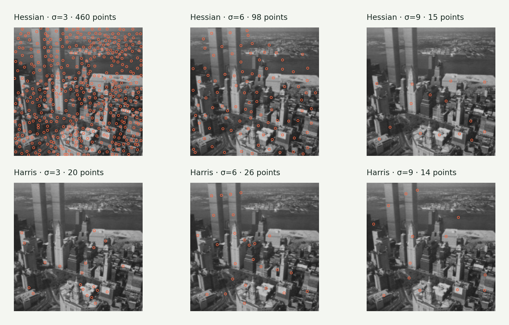
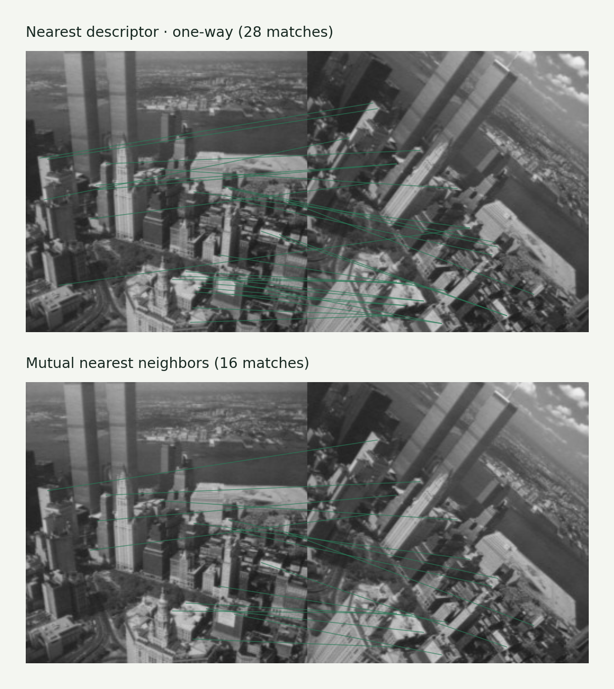

# Assignment 4 · Feature detection, matching & homography

Find distinctive points, match local descriptions across views, and estimate an image alignment despite outliers.

[Original Python submission](assigment4.py) · [Assignment PDF](assignment4_instructions.pdf) · [Interactive companion](https://gabercmatej.github.io/computer-vision-python/#study-4)

### 4.1 Hessian & Harris detectors

Calculate second-derivative and structure-tensor responses, select strong locations and compare detector behavior at different scales. Hessian responses emphasize blob-like structure; Harris responses emphasize variation in two directions.

**Source sections:** 1a–1b.

The plate uses scales 3, 6 and 9 with a normalized 0.4 threshold. Spatial nonmaximum suppression is corrected in the reusable version.

### 4.2 Local descriptor matching

Compare supplied local descriptors using Hellinger distance, first with one-way nearest neighbors and then with a mutual-match check. This removes pairs that do not agree in both directions. The source also contains video stabilization experiments.

**Source sections:** 2a–2b, 2d.

Descriptors come from the course helper; the matching logic is implemented in the submission. The custom-descriptor section 2c is blank. No video input was supplied, so stabilization is code-only.

### 4.3 Homography & RANSAC

Estimate a projective transform with DLT, align supplied point pairs, explore line-fitting RANSAC, reject feature-match outliers, measure reprojection error and implement inverse nearest-neighbor warping.

**Source sections:** 3a–3c, 3e.

The displayed result uses normalized DLT and seeded RANSAC with a consensus refit, added during portfolio cleanup. OpenCV renders this warp; the original custom warp remains in the source. Section 3d is blank.

## Source coverage & reproduction

The original defines stabilization twice; its later SIFT-based implementation overrides the earlier version. It is preserved, not presented as a tested video demo.

The source contains exploratory alternatives and disabled plotting blocks. For a supported reproduction, use the [showcase generator](../showcase/README.md). Course utilities and datasets retain their original authorship; see [credits](../ATTRIBUTION.md).

[← All six assignments](../README.md)
