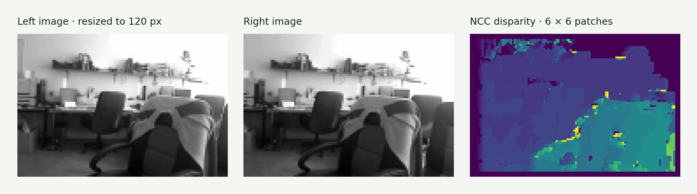
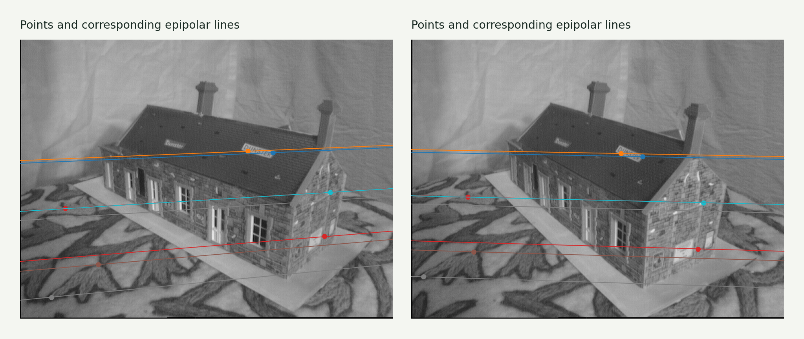
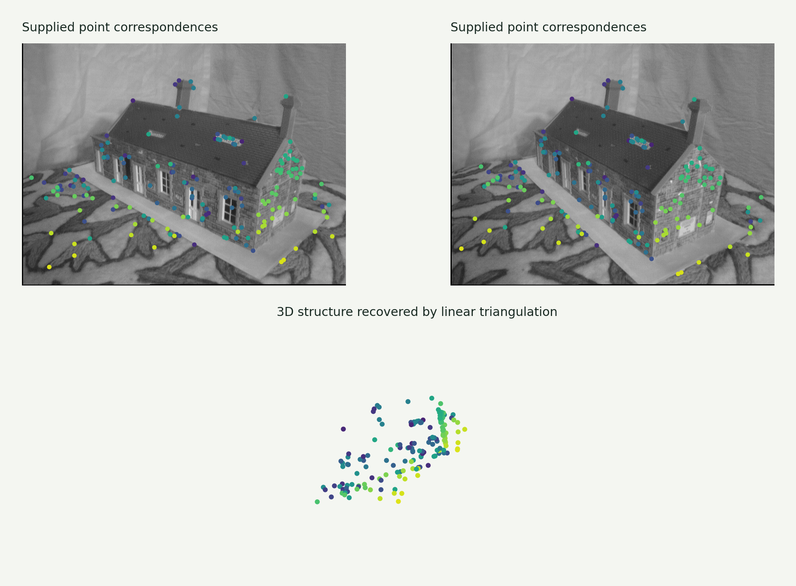

# Assignment 5 · Disparity, epipolar geometry & triangulation

Use the relationship between two views to estimate pixel displacement and recover sparse 3D structure.

[Original Python submission](assigment5.py) · [Assignment PDF](assignment5_instructions.pdf) · [Interactive companion](https://gabercmatej.github.io/computer-vision-python/#study-5)

### 5.1 Disparity from stereo images

Explore the inverse relationship between depth and disparity, implement normalized cross-correlation patch matching, and experiment with consistency filtering, median smoothing and disparity-based warping.

**Source sections:** 1b, 1d–1e.

The displayed NCC result uses images resized to 120 px, 6 × 6 patches and a search limit of 24 px. It shows raw left-to-right disparity. The original reverse-search direction makes its consistency-filter attempt unverified.

### 5.2 Fundamental matrix

Build the normalized eight-point system, solve it with SVD, enforce rank two, draw epipolar lines and calculate symmetric point-to-line distances. A point in one image restricts its match to a line in the other.

**Source sections:** 2b–2c.

Uses supplied house correspondences. Fully automatic fundamental-matrix estimation (2d) and PROSAC (2e) are blank.

### 5.3 Linear triangulation

Stack camera projection constraints and solve for each homogeneous 3D point with SVD. Visualize the recovered house and experiment with fundamental-matrix RANSAC before triangulation.

**Source sections:** 3a–3b.

Both views’ correspondences and camera matrices are supplied. The RANSAC extension also uses supplied matches; this is not a fully automatic reconstruction pipeline.

## Source coverage & reproduction

The browser includes a rotating rendering of the actual reconstructed coordinates. Reprojection error checks consistency with the given cameras, not absolute real-world accuracy.

The source contains exploratory alternatives and disabled plotting blocks. For a supported reproduction, use the [showcase generator](../showcase/README.md). Course utilities and datasets retain their original authorship; see [credits](../ATTRIBUTION.md).

[← All six assignments](../README.md)
