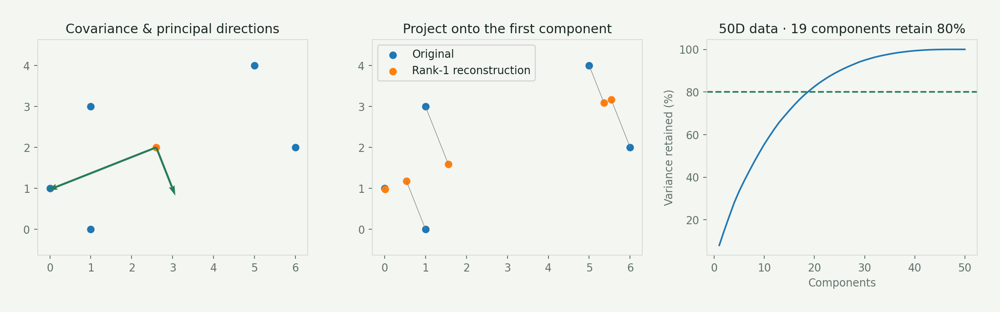
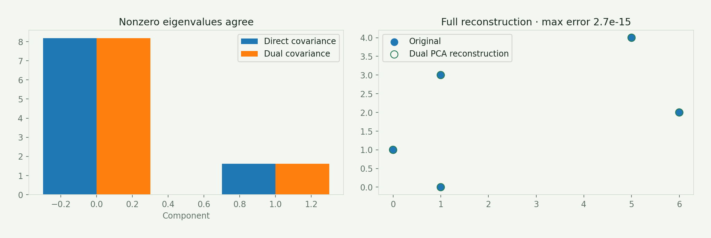
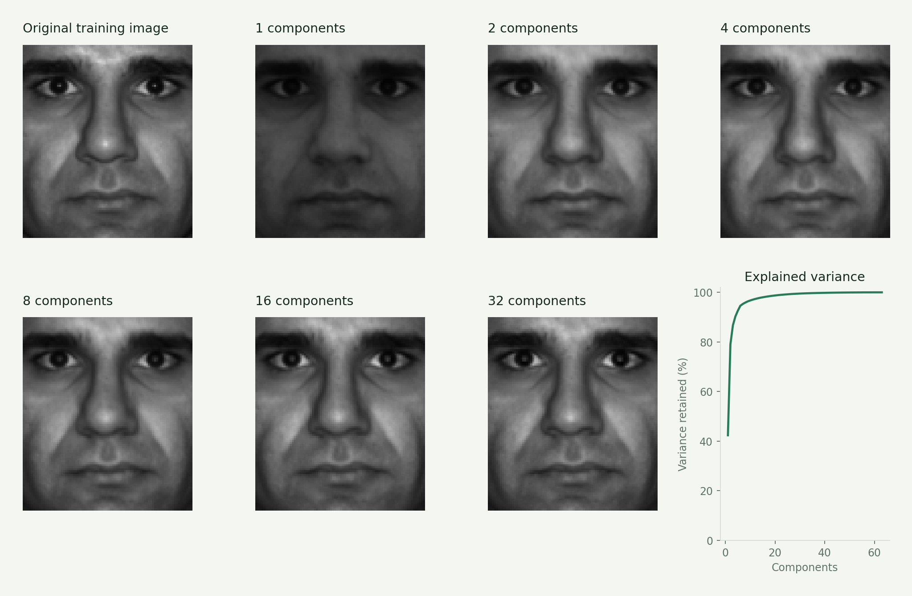
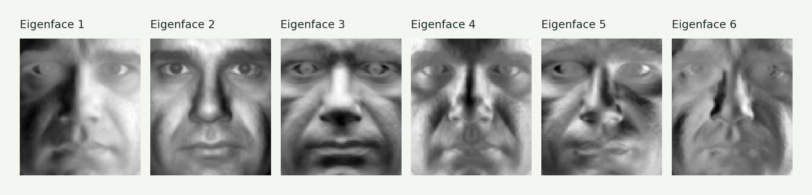

# Assignment 6 · PCA, dimensionality reduction & eigenfaces

Learn directions of variation, compress observations, and reconstruct faces from a small set of coefficients.

[Original Python submission](exercise6.py) · [Assignment PDF](assignment6_instructions.pdf) · [Interactive companion](https://gabercmatej.github.io/computer-vision-python/#study-6)

### 6.1 Direct PCA

Compute the mean, covariance and eigenvectors; draw principal directions; project points onto one component; compare nearest neighbors before and after projection; select components retaining 80% of variance in 50D data.

**Source sections:** 1b–1g.

The figure shows principal directions, rank-one reconstruction and the 50D variance curve. Variance is normalized by the total, correcting the original 1d plot.

### 6.2 Dual PCA

Decompose the sample-space covariance matrix, map its eigenvectors back to feature space, compare nonzero eigenvalues with direct PCA and reconstruct the original points. This is useful when there are many more pixels than training images.

**Source sections:** 2a–2b.

The reusable implementation removes null modes before dividing by singular values. The first source subsection is accidentally labeled 3a, but belongs to Exercise 2.

### 6.3 Face-space decomposition

Load faces as columns, compute eigenfaces, reconstruct images, compare pixel edits with coefficient edits, sweep component counts, vary the first two coefficients and project an elephant image into face space. A webcam-recognition example is also preserved.

**Source sections:** 3a–3g.

The displayed reconstruction uses one of the 64 training images, not a held-out recognition test. Personal webcam training images were not supplied. Several original plotting blocks are disabled.

### Additional result · Learned eigenfaces

## Source coverage & reproduction

The original elephant block reverses resize dimensions, and some disabled plots reference a mismatched shape variable. Those experiments are documented as source work, not verified recognition results.

The source contains exploratory alternatives and disabled plotting blocks. For a supported reproduction, use the [showcase generator](../showcase/README.md). Course utilities and datasets retain their original authorship; see [credits](../ATTRIBUTION.md).

[← All six assignments](../README.md)
