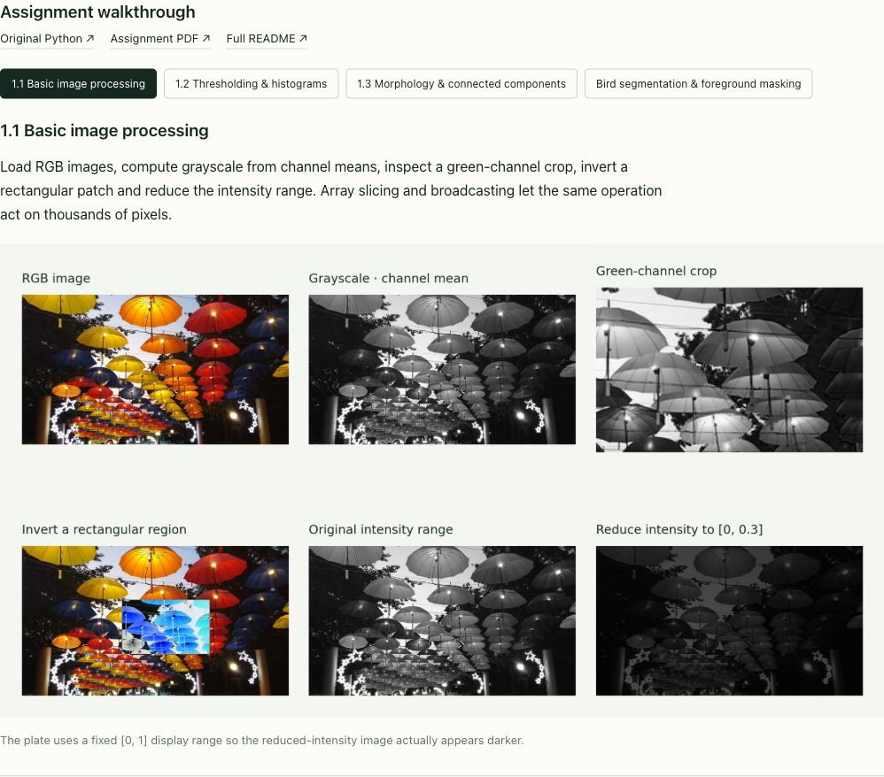
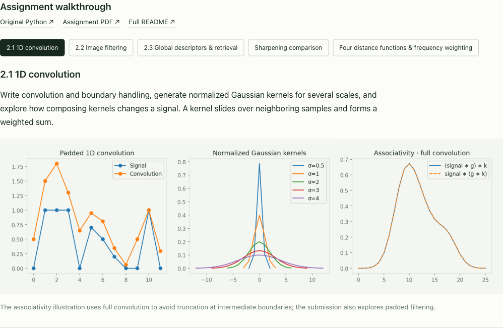
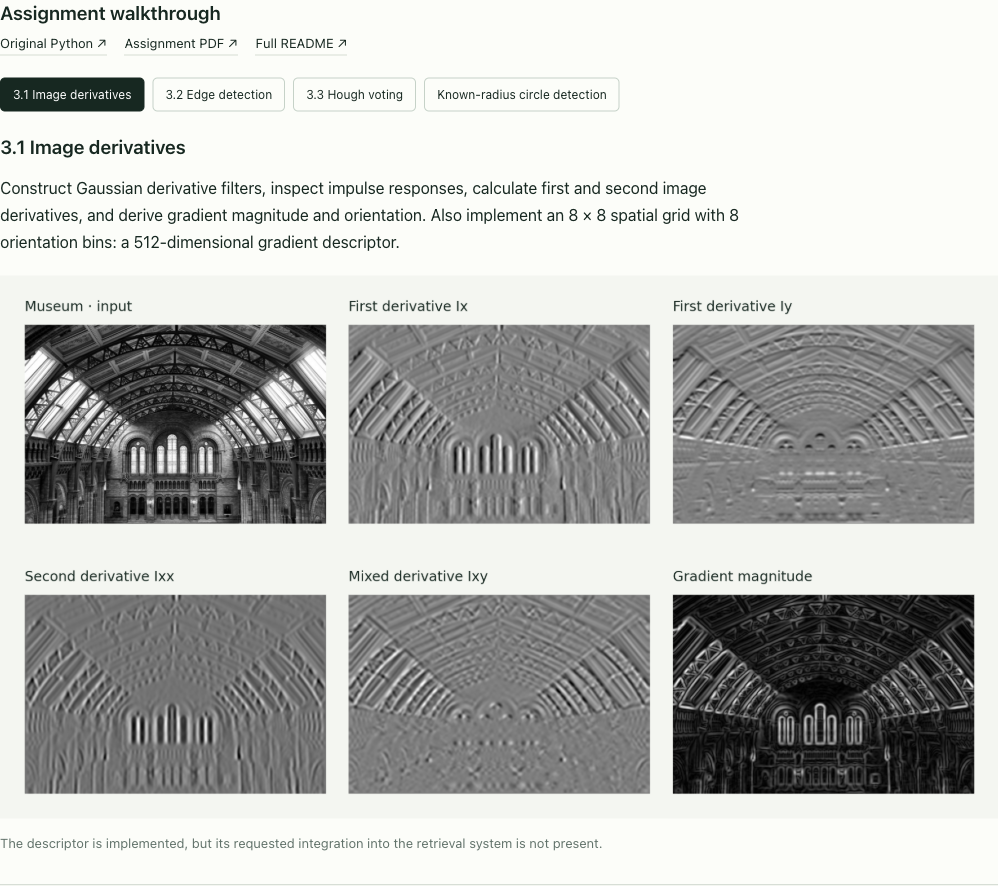
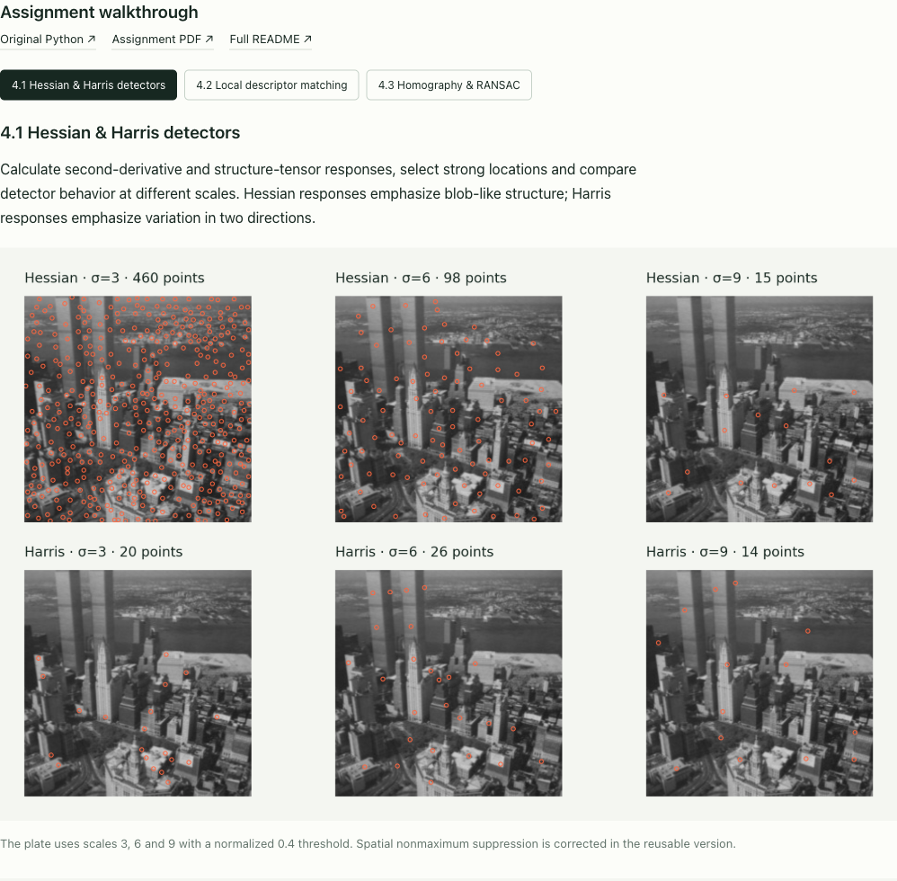
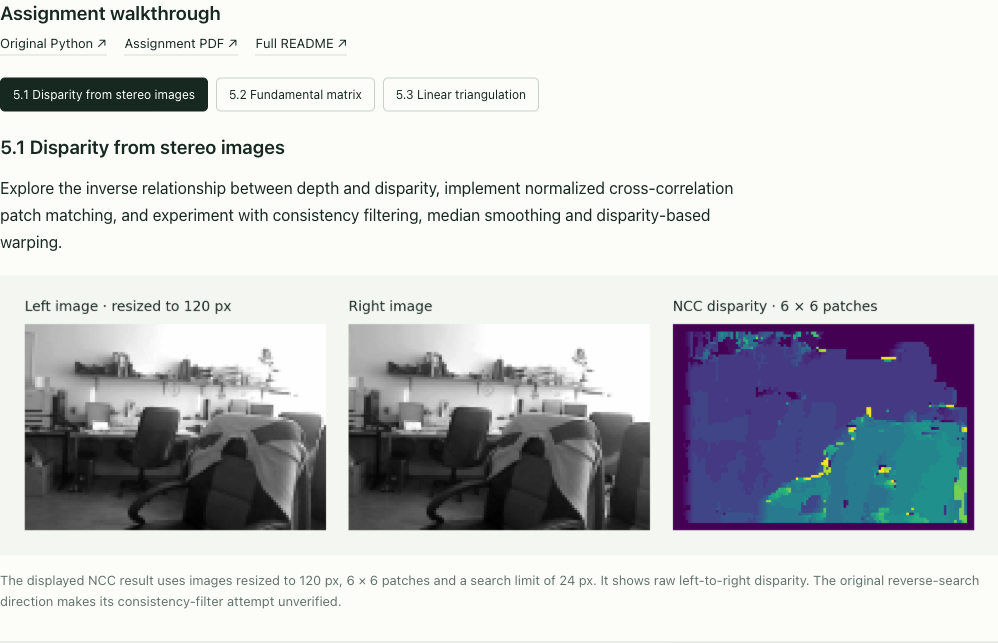
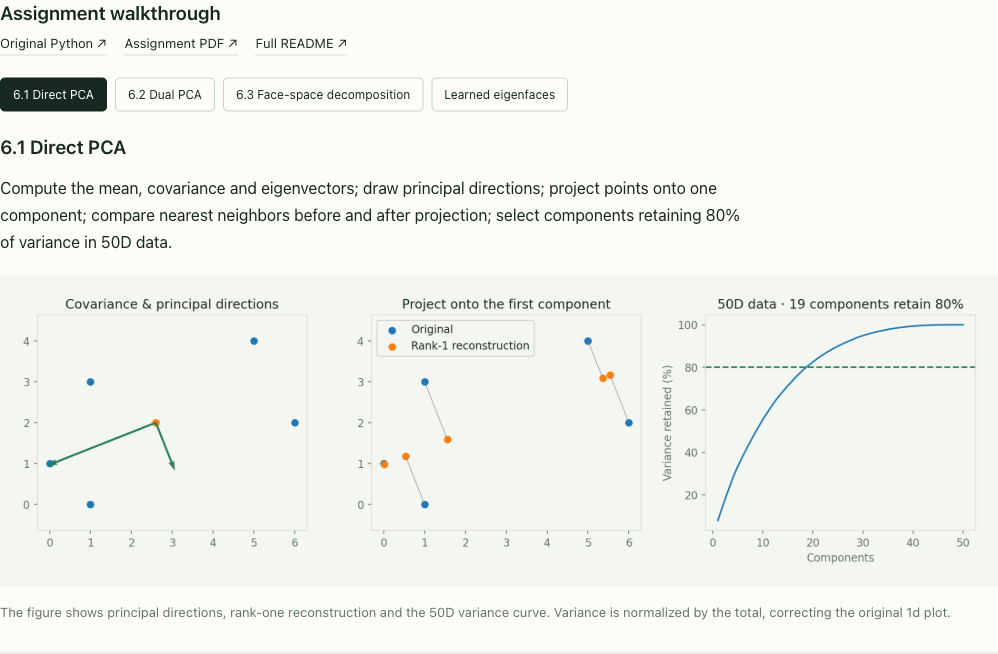

# Interactive companion & reproducible results

[← Browse the six original assignments](../README.md) · [Open the live companion](https://gabercmatej.github.io/computer-vision-python/)

This folder contains the presentation and runnable adaptations added to the original coursework. The main repository README walks through all 18 main exercises. Original Python scripts, PDFs and supplied datasets live in the six assignment folders at the repository root.

## Run locally

From the repository root, with Python 3.12 or newer:

```sh
cd showcase
python -m venv .venv
source .venv/bin/activate
pip install -r requirements.txt
python -m cvportfolio.generate
python -m unittest discover -s tests -v
python scripts/check_assets.py
python -m http.server 8000 --directory site
```

Open http://localhost:8000. The generator creates the six interactive experiments, their measured results and expanded task-by-task plates. It reads the original course datasets, uses a fixed seed where random sampling is involved, and saves figures into `site/assets/`. The browser selects precomputed Python results; it does not execute Python.

| Folder | Contents |
|---|---|
| `cvportfolio/` | Adapted algorithms and figure generators |
| `cvportfolio/walkthrough.py` | Additional plates for the assignment walkthroughs |
| `tests/` | Numerical algorithm checks |
| `scripts/` | Asset and link validation |
| `site/` | Static HTML, CSS, JavaScript, generated results and UI screenshots |

Original code and portfolio adaptations are distinguished in [PROVENANCE.md](../PROVENANCE.md). Supplied helper functions are retained under `cvportfolio/course_utils/`. GitHub Pages publishes `site/` through the repository’s Pages workflow.

## Interface screenshots












